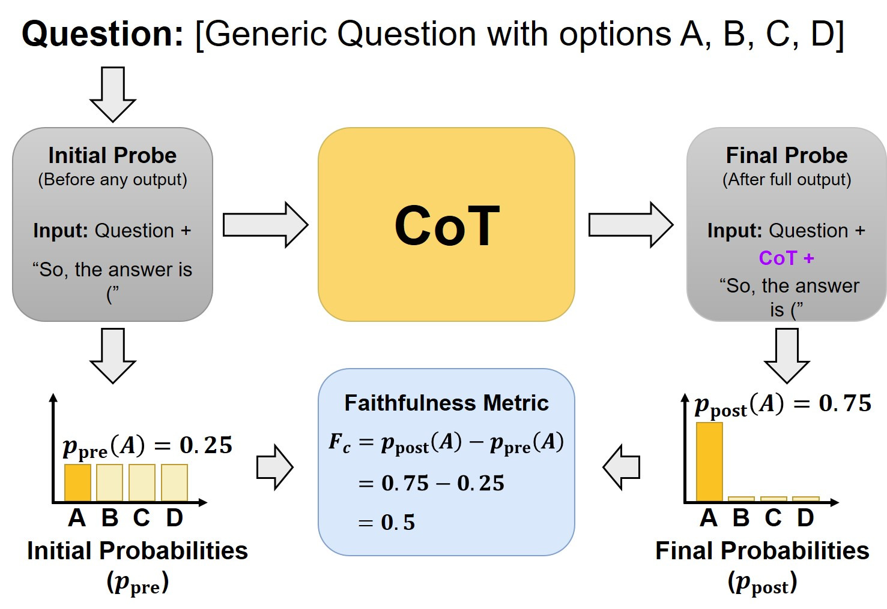
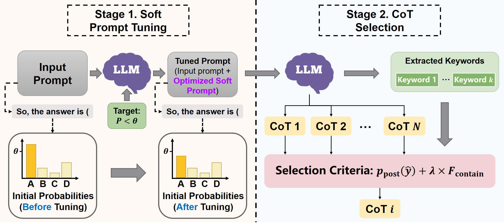
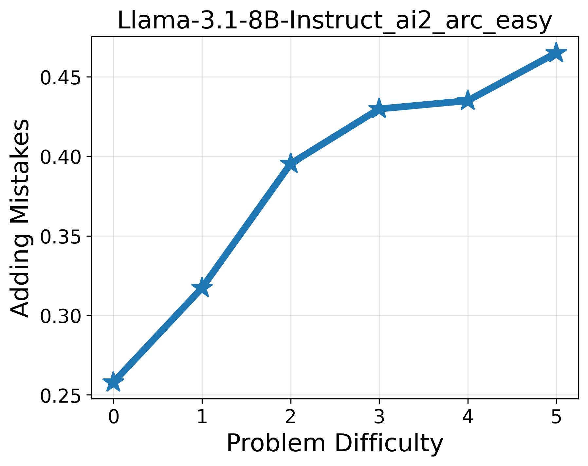
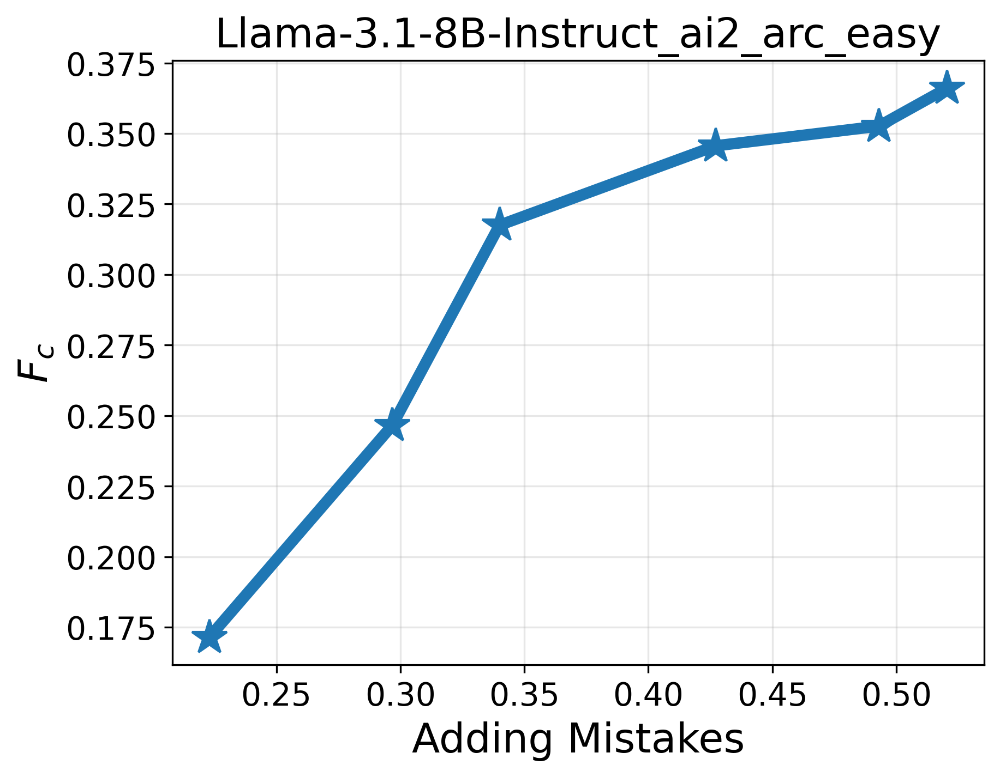

# CMG-CoT: Efficiently Measuring and Effectively Enhancing Chain-of-Thought Faithfulness via Confidence Modulation

<div align="center">

[](https://www.python.org/)
[](LICENSE)

 **A comprehensive framework for analyzing and improving the faithfulness of LLMs' reasoning processes.**

[Abstract](#-abstract) • [Methodology](#-methodology) • [Installation](#%EF%B8%8F-installation) • [Usage](#-usage)

</div>

---

## 📖 Abstract

This repository contains the implementation of **CMG-CoT**. We investigate the faithfulness of Chain-of-Thought (CoT) reasoning in Large Language Models (LLMs) through three key research questions:

1.  **RQ1:** How does problem difficulty influence CoT faithfulness?
2.  **RQ2:** How can we efficiently evaluate CoT faithfulness? (Proposed $F_c$ Metric)
3.  **RQ3:** How can we enhance CoT faithfulness? (Proposed CMG-CoT Framework)

Our approach introduces a novel **Confidence-based Metric ($F_c$)** and a **Confidence Modulation & Guided Selection** framework that significantly improves reasoning faithfulness without compromising accuracy.

---

## 🔬 Methodology

### 1. The Efficient Faithfulness Metric ($F_c$)
To address the high computational cost of existing perturbation-based metrics, we propose $F_c$, which measures the confidence shift in model predictions pre- and post-reasoning.

<div align="center">
  
  <br>
  <em>Figure 1: Illustration of the calculation pipeline for the proposed faithfulness metric $F_c$.</em>
</div>

### 2. The CMG-CoT Framework
Our enhancement framework consists of two stages:
* **Stage 1:** Soft Prompt Tuning to modulate initial confidence.
* **Stage 2:** Metric-Guided Selection to select the faithful reasoning chain.

<div align="center">
  
  <br>
  <em>Figure 2: The main process of the CMG-CoT method.</em>
</div>

---

## ⚙️ Installation

### 1. Clone the Repository
```bash
git clone https://anonymous.4open.science/r/CMG-CoT
cd CMG-CoT
```


### 2. Install Dependencies
```bash
pip install -r requirements.txt
```

### 3. Prepare Data and Models
⚠️ Important: Before running the code, please create the following directories in the root folder and place your datasets and model checkpoints inside them.
```bash
mkdir datasets
mkdir models
```

* **Datasets**: Place your dataset files (e.g., ARC-Easy, etc.) into `/datasets`.
* **Models**: Place your LLM weights (e.g., Llama-3.1-8B-Instruct) into `/models`.

---

## 🚀 Usage

### 📊 1. Analysis: Relationship & Correlation (RQ1 & RQ2)

Use `faithfulness_relationship.py` to analyze the relationship between problem difficulty and faithfulness (RQ1), and the correlation between the "Adding Mistakes" metric and our $F_c$ metric (RQ2).

```bash
python faithfulness_relationship.py --dataset ai2_arc_easy --model_name Llama-3.1-8B-Instruct -api YOUR_API_KEY
```

**Outputs:**
* Intermediate results saved in `Results/`.
* Visualization graphs generated automatically:

<div align="center">
  <table>
    <tr>
      <td align="center">
        
        <b>RQ1 Analysis:</b> Correlation between Problem Difficulty and Adding Mistakes Metric.
      </td>
      <td align="center">
        
        <b>RQ2 Analysis:</b> Correlation between Adding Mistakes and our proposed $F_c$ Metric.
      </td>
    </tr>
  </table>
</div>

### 🛠️ 2. Enhancement: Running CMG-CoT (RQ3)

Use `CMG-CoT.py` to run the proposed faithfulness enhancement framework.

```bash
python CMG-CoT.py --dataset ai2_arc_easy --model_name Llama-3.1-8B-Instruct -api YOUR_API_KEY
```
**Outputs:**
* Intermediate results saved in `Results/`.
* The script will output the accuracy and faithfulness metrics:

```plaintext
==================================================
Dataset: ai2_arc_easy
Total Samples: 500
Correct Number: 461
Accuracy: 0.9220 (92.20%)
counterfactual_faithfulness_metric: 0.0549  (Lower is better)
Adding Mistakes Metric: 0.84                (Higher is better)
==================================================
```

---
